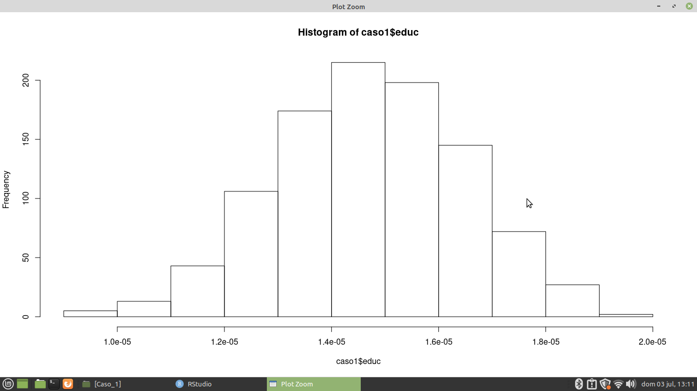

# AP2_Caso_1_Renda_Familiar

** Analise de dados sobre familias que vivem na pobreza  ** 

* Conjunto de dados distribuído pelo Professor Lucas Magalhães para um trabalho final na Academia de Profissões 
que detalha a queda dos preços da principal commodity exportada no mercado internacional em 2001, onde foi observada no pais X
um aumento expansivo de famílias vivendo abaixo da linha da probreza. 

## Tarefas para a planilhia da AP2_Caso_1_Renda_Familiar

** Indicação de desenho adequado para a identificação do efeito da PP ** 
   
** Tabela de Balançeamento por estimação da educação e pop (Comparação entre pp e sexo) ** 

** Matching, apresentar a tabela de balanceamento antes e depois do pareamento ** 

** Frequencia de Histograma para media o caso da educação **

** Propensy Score ** 

## Passos para a tarefa 

    1 - Importando o caminho do disco para a Linguagem 
    2 - Lendo o caminho do disco 
    3 - Instalando as bibliotecas para gerar gráficos e Agrupamento de dados
    4 - Lendo as Bibliotecas para gerar gráficos e Agrupamento de dados
    5 - Criando o Efeito de Politica por educação por um logaritmo neperiano 
    6 - Criando uma Variável ficticia do efeito PP por educação e calculo do logaritmo neperiano
    7 - Variável ficticia do efeito PP por Pop em renda e calculo do logaritmo neperiano 
    8 - Relacionando o dentro do estimator de sexo para pp 
    9 - Relacionando dentro do estimator de pp para sexo com calculo de renda 
    10 - Relacionando dentro do estimator de pp para sexo 
    11 - Relacionando dentro do estimator de sexo para pp com calculo de renda 
    12 - Definindo a Tabela de Balanceaçmento de Pop e Renda para o PP 
    13 - Definindo a Tabela de Balanceaçmento Educ e educ2004 para o PP 
    14 - Definindo a Tabela de Balanceaçmento Pop e Renda para o Sexo 
    15 - Definindo a Tabela de Balanceaçmento Educ e Educ2004 
    16 - Indicando o Indice de desempenho dos sexos por educação 
    17 - Calculando a renda pela media na educação por desvio padrão na educação 2004 
    18 - Selecionando os sexo e pp por educ2004
    19 - Verificação de dados 
    20 - Foi Realizado o Algoritmo de Matchit 
    21 - Foi criado um novo banco de dados só com os pareados 
    22 - Foi feito Caso Pareado de Teste 
    23 - Teve Regressão Linear 
    
## Tecnologias Utilizadas 

** O projeto foi desenvolvido com as seguintes tecnologia ** 

- [R](https://www.r-project.org/)

## Pacotes Utilizados 

** Pacotes para a sessão de Regressão Linear

- [stargazer](https://www.rdocumentation.org/packages/stargazer/versions/5.2.3/topics/stargazer)

** Pacote para consultas de colunas 

- [tidyverse](https://www.tidyverse.org/)
- [dplyr](https://dplyr.tidyverse.org/) 

** Pacotes para a geração de Gráficos 

- [hist](https://sosestatistica.com.br/como-fazer-e-analisar-um-histograma-no-r/)

** Pacotes para a geração de tabelas 

- [vtable](https://www.rdocumentation.org/packages/vtable/versions/1.3.3/topics/vtable) 

** Pacotes para a geração de dados estatísticos 

- [foreign](https://stats.oarc.ucla.edu/r/faq/how-to-input-data-into-r/) 

** Pacotes para a geração de modelos lineares para dados em painel estimados em dados transformados

- [plm](https://www.rdocumentation.org/packages/plm/versions/2.6-1/topics/plm)

** Pacotes de Modelos Paramétricos para inferência causal, selecionando subconjuntos bem combinados dos grupos que tratados e da controle a originais

- [MatchIt](https://stats.oarc.ucla.edu/r/faq/how-to-input-data-into-r/) 

## Imagens dos Gráficos 

** Gráfico da Educação ** 

** Sumário Estatístico de PP para id, sexo, educ2004, educ **

** Sumário Estatístico de PP para id, pop, sexo, renda  ** 

** Sumário Estatístico de sexo para id, pp, educ2004, educ  ** 

** Sumário Estatístico de sexo para id, pp, pop, renda  ** 

Desenvolvido por Gustavo Henrique de Souza Silva

